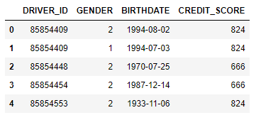
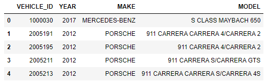
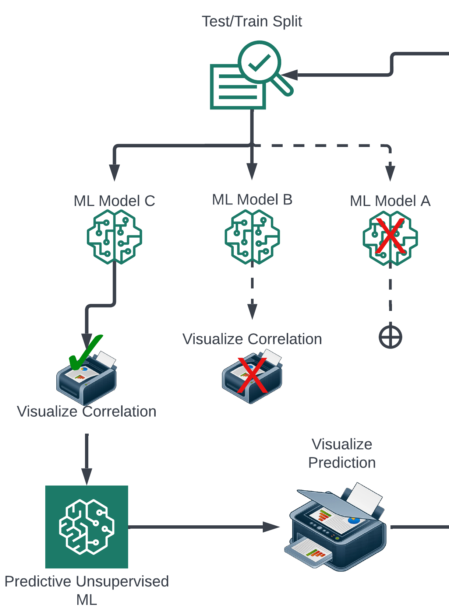

# Year, Make, Model, Credit.
  
 

#### &nbsp;&nbsp;&nbsp;&nbsp;&nbsp;&nbsp;There is a belief held by many, that individuals who drive more high-dollar extravagant
#### cars ***must*** be more financially well off than the rest of us. Is there a way to find out…?&nbsp;&nbsp;&nbsp;&nbsp;&nbsp;&nbsp;
  
 

**Hypothesis:** If provided Year,Make, And Model of vehicle, **it is** possible to predict the
owner’s credit score based on historical ownership data.
  
 

## Goals
1. Create a project that showcases skills learned in the past 6 months regardless of
content or conclusion.
2. Adapt the accessory project materials as the project develops for references in the
future. (Outline, Flowchart, Best-Use Technologies, etc…)
3. Develop a machine learning model and train using insurance data.
4. Make predictions using ML to generate insight into credit/financial health.
  
  

### Questions to Answer:

1.) If a relationship exists….?
- How strongly does the machine learning model embody the
correlation between car vs. credit?
- Does this relationship have a strong enough correlation to be used as
a predictor of credit?
- How exact is the credit prediction? (+/- 10 points? Within 10-20%
accuracy?)

2.) If no predictive relationships exist? 
- Can any interesting trends be found?

    - (Car vs. average insurance pmt)   
    - (Car vs. rate of “high risk” insurance drivers)
    - (Car vs. more than 2 clusterings of credit scores)  

- How can the relationships found be used to generate insight based on
the car someone drives?

## Project Outline:
  

### Phase 1: ETL
I. Source Raw Data 
II. What is the data format? (.JSON, .CSV, etc…) 
III. How to extract the raw data from the data source? (Python?, JavaScript?) 
&nbsp;&nbsp;&nbsp;&nbsp;&nbsp;&nbsp;A. How much data will be extracted? 
&nbsp;&nbsp;&nbsp;&nbsp;&nbsp;&nbsp;B. Does the raw data need to be compressed? 
&nbsp;&nbsp;&nbsp;&nbsp;&nbsp;&nbsp;C. Can this data be moved/stored efficiently for free? 
IV. Convert the raw data to share the same format (change from JSON-> CSV or CSV ->Data Frame before cleaning) 
V. Where to store raw data after extraction and formatting? (AWS?) 
&nbsp;&nbsp;&nbsp;&nbsp;&nbsp;&nbsp;A. How do we access this data (Amazon URL endpoint?) 
&nbsp;&nbsp;&nbsp;&nbsp;&nbsp;&nbsp;B. Does the data need to be in a compressed format for all future data
transfers? 
VI. Clean the Raw Data 
VII. Choose between Postgres/python/mongodb to drop useless/null information and ensure the data sets can be merged as needed. 
VIII. Where to store clean data? (S2 bucket?) 
IX. How to access clean data efficiently? (zip needed?) 
&nbsp;&nbsp;&nbsp;&nbsp;&nbsp;&nbsp;**See Below:** 
 

### Phase 2: Exploratory Analysis
It is important at this point to re-evaluate the best course of action to take to answer the core questions of the study:  

                            1.) If a relationship exists….?
                        - How strongly does the machine learning model embody the
                        correlation between car vs. credit?
                        - Does this relationship have a strong enough correlation to be used as
                        a predictor of credit?
                        - How exact is the credit prediction? (+/- 10 points? Within 10-20%
                        accuracy?)

                        2.) If no predictive relationships exist? 
                        - Can any interesting trends be found?

                            - (Car vs. average insurance pmt)   
                            - (Car vs. rate of “high risk” insurance drivers)
                            - (Car vs. more than 2 clusterings of credit scores)  

                        - How can the relationships found be used to generate insight based on
                        the car someone drives?
The ML conducted in the exploratory analysis should result in enough conclusive evidence to make a judgement of what is needed for the predictive model.  
**Note:** See figure below for a diagram of the ML pipeline

  
Following the ML pipeline: 
X. Implement Machine Learning on Clean data 
XI. What data needs to be merged? 
XII. Python ML models 
XIII. Use models to identify or disprove relationships 
&nbsp;&nbsp;&nbsp;&nbsp;&nbsp;&nbsp;A. Which combination of data sets work as the best predictors? 
&nbsp;&nbsp;&nbsp;&nbsp;&nbsp;&nbsp;B. Are any data sets reliant on others to create a discernible testable
relationship? 
 

### Phase 3: Predictive ML
XIV. (OPTIONAL) Use Predictive ML to Develop a Projection 
XV. Are the discovered relationships statistically significant enough to do predictive ML
on? 
XVI. Use the best ML-found predictors of inflation to create an inflationary projection
using predictive ML. 
A. Test multiple predictive algorithm models to find a best fit 
 

### Phase 4: Display Findings
XVII. Format initial and final ML models to be useable in a webpage 
XVIII. Website 
XIX. Display findings from ML models in an exciting way 
XX. Documentation
